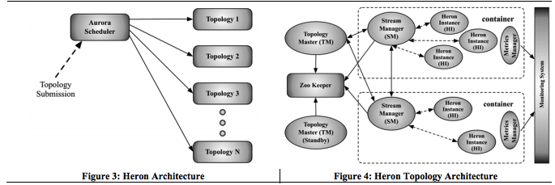
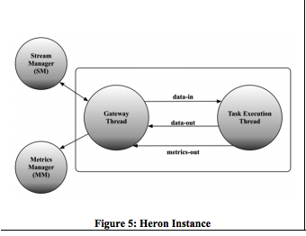
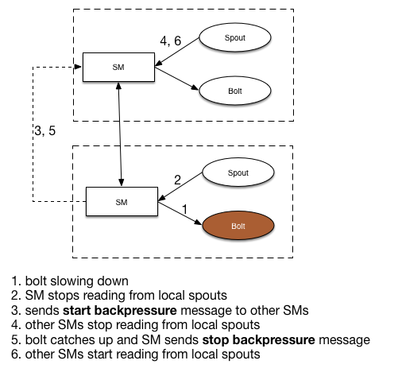
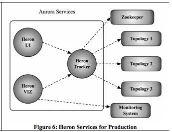
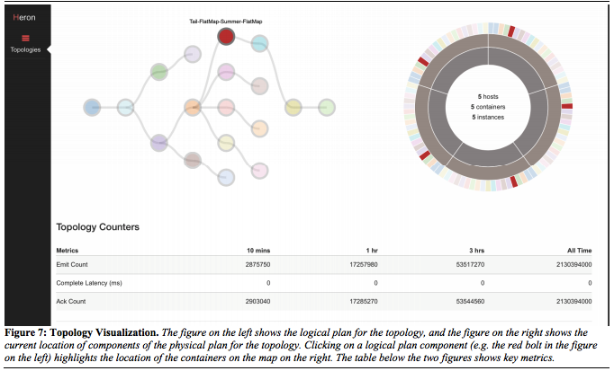
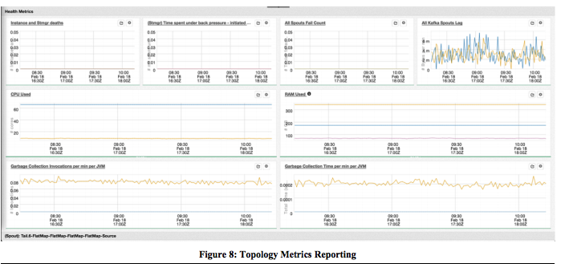
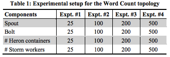
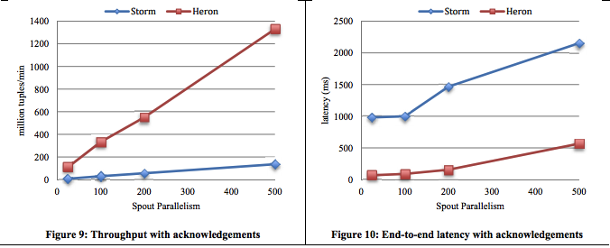
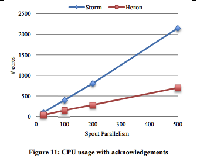
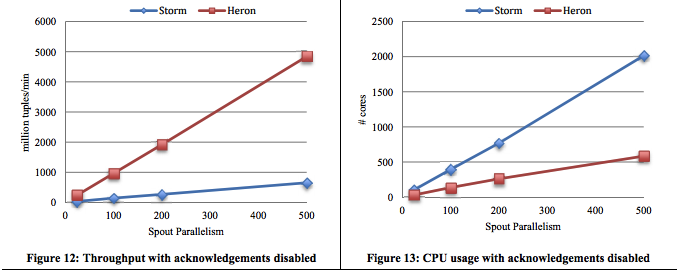

name: inverse
class: middle, center, inverse

# Heron

[ˈherən]

---

---

# Agenda

1. Streaming System @Twitter
2. Storm limitations 
3. Heron 

---

# Streaming System @Twitter (In 2014)

* Several hundreds of Storm topologies run on hundreds of servers (spread across multiple datacenters).
* Many TBs of data flows through the Storm clusters every day, generating several billions of output tuples. 
* A large number of topologies have fewer than three stages. 
* Topologies are isolated on their machines.
* p99 latency for processing a tuple is close to 1ms, and cluster availablity is 99.9% over the last 6 months. 

---

# Streaming System @Twitter (In 2015)

* Storm has been decommissioned and Heron is now the de-facto streaming system. 
* It has been in production for several months and runs hundreds of development and production topologies in multiple data centers. 
* These topologies process several tens of terabytes of data, generating billions of output tuples. 
* Results from an empirical evaluation of Heron demonstrate **large reductions in CPU resources** when using Heron, while delivering **6-14X improvements in throughput**, and **5-10X reductions in tuple latencies**. 

---

# Storm limitations (1/2)

* Multiple levels of scheduling and their complex interaction leads to uncertainty about when tasks are being scheduled.
* Each worker runs a mix of tasks, making it difficult to reason about the behaviour and performance of a particular task. Logs from multiple tasks are also mixed up in a single file.
* An unhandled exception in a single task takes down the whole worker process killing other (perfectly fine) tasks.
* Storm assumes that every worker is homogeneous, which results in inefficient utilization of allocated resources, and often results in over-provisioning.
* Because of the large amount of memory allocated to workers, use of common profiling tools becomes very cumbersome.
* Storm workers belonging to different topologies but running on the same machine can interfere with each other, which leads to untraceable performance issues. 

???

Twitter had to run production Storm topologies in isolation on dedicated machines. Which of course leads to wasted resources.

---

# Storm limitations (2/2)

* Each tuple has to pass through four threads in the worker process from the point of entry to the point of exit. This design leads to significant overhead and contention issues.
* A tuple failure anywhere in the tuple tree leads to failure of the whole tuple tree.
* Nimbus is a single point of failure. When it fails, you can’t submit any new topologies or kill existing ones. Nor can any topology that undergoes failures be detected and recovered. 
* Nimbus is functionally overloaded and becomes an operational bottleneck.
* There is no backpressure mechanism. This can result in unbounded tuple drops with little visibility into the situation when acknowledgements are disabled. Work done by upstream components can be lost, and in extreme scenarios the topology can fail to make any progress while consuming all resources.
* Topologies using a large amount of RAM for a worker encounter gc cycles greater than a minute.

---

# Heron

> For our needs at Twitter, we needed a stream processing platform that was open-source, high-performance, scalable, and was compatible with the current Storm API. We also needed the platform to work on a shared infrastructure.

---

# Heron Data Model and API

* identical to that of Storm
    - topology
    - spout / bolt
    - grouping

* similar processing semantics 
    - at most once 
    - at least once

---

# Heron Architecture

.center[]

* Scheduler abstraction facilitates running Heron on YARN, Mesos and ECS.
* Topology Master / Stream Manager / Heron Instance / Metrics Manager
* All Heron processes communicate with each other using protocal buffers.

???

* Startup Sequence
  1. scheduler schedules topology containers. 
  2. TM comes up on the first container and make itself discoverable using the Zookeeper ephemeral node. 
  3. SM on each container consults Zookeeper to discover TM and then connects to TM and periodically sends heartbeats.
  4. TM assigns components to different containers and sends entire physical plan to SMs 
  5. HIs come up, discover local SM, download physical plan and start executing.
  6. TM writes physical plan to Zookeeper

* Topology Master
  - manages topology throughout its existence
  - single point of contact for discovering the status of the topology

* Stream Manager
  - manages the routing of tuples 

* Metrics Manager
  - collecs and exports metrics from all the components in the system

---

# Heron Instance 

.center[]

* Each HI is a JVM process, which runs only a single task of the spout or the bolt.
* Data-in and data-out queues are bounded in size.
* Periodically check their capacities and increase/decrease their sizes to avoid GC issues.

---

# Spout Backpressure

.center[]

???

Every socket channel is associated with an application-level buffer that is bounded in size by both a high water mark and a low water mark. 

---

# Heron Services

.center[]

* Heron Tracker acts as a gateway to access information about topologies through REST API.

---

# Heron UI 

.center[]

---

# Heron Viz

.center[]

---

# How is Heron better than Storm

1. The provisioning of resources is abstracted from the duties of the cluster manager so that Heron can play nice with the rest of the shared infrastructure.
2. Each Heron Instance executes only a single task so is easy to debug.
3. The design makes transparent which component of the topology is failing or slowing down as the metrics collection is granular and can easily map an issue to a specific process in the system.
4. Heron allows a topology writer to specify exactly the resources for each component, avoiding over-provisioning.
5. Having a Topology Manager per topology enables them to be managed independently and failure of one topology does not affect the others.
6. The backpressure mechanism gives a consistent rate of delivering results and a way to reason about the system. It is also a key mechanism that supports migration of topologies from one set of containers to another.
7. It does not have any single point of failure.

---

# Performance (Setup)

.center[]

---

# Performance (Ack Enabled)

.center[]

---

# Performance (Ack Enabled)

.center[]

---

# Performance (Ack Disabled)

.center[]

---

# References

1. http://blog.acolyer.org/2015/06/15/twitter-heron-stream-processing-at-scale/
2. [Twitter Heron: Stream Processing at Scale](http://dl.acm.org/citation.cfm?id=2742788) (SIGMOD '15)
3. [Storm @Twitter](http://cs.brown.edu/courses/cs227/papers/ss-storm.pdf) (SIGMOD '14)
4. [From Gust To Tempest: Scaling Storm](http://www.slideshare.net/RobertEvans26/scaling-apache-storm-hadoop-summit-2015) (Hadoop Summit '15)
5. https://blog.twitter.com/2015/flying-faster-with-twitter-heron
